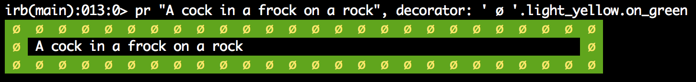

# Priscilla

Frock up your console messages. :dancer: :dancer: :dancer:

[](https://travis-ci.org/Arkham/priscilla)
[](https://codeclimate.com/github/Arkham/priscilla)
[](https://codeclimate.com/github/Arkham/priscilla)

## Why Priscilla

Because of [Priscilla, Queen of the Desert](http://en.wikipedia.org/wiki/The_Adventures_of_Priscilla,_Queen_of_the_Desert).

**Don't let your console messages drown in a wall of text, make them stand out!**


## Install

Add this line to your application's Gemfile:

    gem 'priscilla'

And then execute:

    $ bundle

Or install it yourself as:

    $ gem install priscilla

## Use

Require the gem:

    require 'priscilla'

Use `pr` to frock up your console messages

    pr "A cock in a frock on a rock"

Result


## Decorators

Priscilla supports a lot of different decorators:

**Strings**


**Colored Strings**




**Unicode Emojis**


**Text Emojis**


## Configure

If you're using Rails, create an initializer in `config/initializers/priscilla.rb`:

```ruby
# This is the default configuration
Priscilla.configure do |c|
  c.width = 80
  c.decorator = ':dancer: '
  c.presenter = ->(msg) { puts msg; puts }
end
```

If you prefer to use the Rails logger, here is an example:

```ruby
Priscilla.configure do |c|
  c.width = 80
  c.decorator = ':dancer: '
  c.presenter = ->(msg) { Rails.logger.debug msg }
end
```

## Troubleshoot

**I can't see the fancy emojis!!! I'm on Linux!!!**

On Ubuntu: `sudo apt-get install ttf-ancient-fonts`

On Fedora: `yum install gdouros-symbola-fonts`

## Contribute

1. Fork it ( http://github.com/Arkham/priscilla/fork )
2. Create your feature branch (`git checkout -b my-new-feature`)
3. Commit your changes (`git commit -am 'Add some feature'`)
4. Push to the branch (`git push origin my-new-feature`)
5. Create new Pull Request
